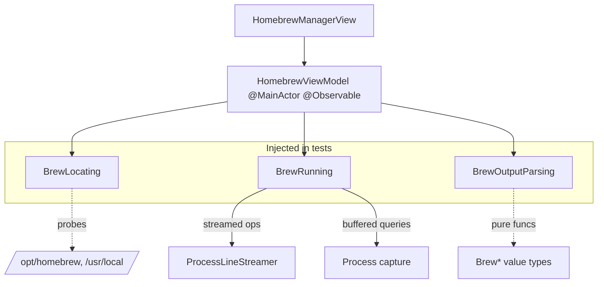

# Design Document

## Overview

The Homebrew Manager adds a package-management surface to VaderCleaner that inventories, updates, uninstalls (dependency-aware), and cleans up software installed through Homebrew. It reuses the app's existing process-streaming engine and follows the same injected-seam, `@MainActor @Observable` view-model pattern already used by `AppUpdaterViewModel` and `AppUninstallerViewModel`.

The design centers on four collaborators, all injected as protocols or closures so the view model is fully unit-testable with no real `brew`:

- **`BrewLocating`** — resolves the `brew` executable path (Req 1) or reports its absence.
- **`BrewRunning`** — the single seam through which every `brew` invocation flows (Req 2, Req 10). Two flavors: buffered (capture full stdout, for JSON queries) and streamed (line-by-line for long mutating operations, Req 9).
- **`BrewOutputParsing`** — pure functions over `brew` stdout/JSON (`list`, `outdated --json=v2`, `leaves`, `uses`, `cleanup -n`) so every payload shape is fixture-testable (Req 10.3).
- **`HomebrewViewModel`** — the `@Observable` state machine the view binds to, orchestrating the four operations and their confirmation gates.

Two facts drive the architecture and are load-bearing: the app is **not sandboxed** (it may spawn `brew` directly), and Homebrew **refuses to run as root**, so this path never touches the privileged XPC helper — it is strictly a user-context `Process`, exactly like the existing ClamAV `freshclam`/`clamscan` invocations.

## Architecture

### Placement decision (Req 11)

**Final placement:** Homebrew is folded into the **Uninstaller and Updater panes** of `ApplicationsManagerView` as a **"Homebrew" facet under each pane's "Stores" group** (next to App Store / Other) — there is no dedicated Homebrew pane or dashboard button. Selecting the facet swaps the pane's right column to a parallel brew list (`HomebrewUninstallContent` / `HomebrewOutdatedContent`); the shared footer's Uninstall / Update actions dispatch to `brew uninstall` / `brew upgrade` when the Homebrew facet is active. Cleanup and remove-orphans live as a reclaim action row inside the Uninstaller's Homebrew view. The app view models (`AppUninstallerViewModel`, `AppUpdaterViewModel`) are untouched — Homebrew is a separate data source keyed off the injected `HomebrewViewModel`, not an `AppInfo`/`UpdateInfo` filter. The facet loads its inventory lazily on first selection (`loadIfNeeded` / `checkUpdatesIfNeeded`) so brew isn't run on every manager open.

This superseded two earlier iterations: a standalone `HomebrewManagerView` screen (rejected — its white cards rendered white-on-white over the dark section background, since it lacked the manager's forced-light chrome) and a dedicated Homebrew pane (rejected in favor of categorizing packages under Stores, where they belong as an install source). The Homebrew logic (view model, runner, parser, locator) is unchanged across all three — only the view layer differs. Original rationale for keeping it within the Applications section:

- The Applications section is already the home for "software you installed and can update/remove"; App Updater and App Uninstaller live there as sibling manager surfaces. Homebrew packages are the same mental model (installed software), so a peer destination is the least surprising placement and avoids adding another rail icon.
- Casks overlap conceptually with `.app` bundles the App Uninstaller already handles; co-locating them keeps the "how do I remove this thing" answer in one section.
- Keeping it a self-contained `HomebrewManagerModel` + `HomebrewViewModel` + `HomebrewManagerView` module means it can be promoted to its own `NavigationSection` later with a one-line rail registration if it outgrows the Applications section — nothing about the internals depends on the placement.

The Applications dashboard gains a Homebrew entry that routes to `HomebrewManagerView`, and the view exposes a refresh entry point carrying a stable accessibility identifier consistent with the app's `section.*`/`sidebar.*` conventions (Req 11.2).

### Component diagram



### Execution flow (happy path)

```mermaid
sequenceDiagram
    participant U as User
    participant VM as HomebrewViewModel
    participant R as BrewRunning
    participant P as BrewOutputParsing

    U->>VM: open section
    VM->>VM: locate brew (Req 1)
    alt not found
        VM-->>U: .notInstalled empty state
    else found
        VM->>R: list --formula/--cask --versions, leaves (buffered)
        R-->>VM: stdout
        VM->>P: parse inventory
        P-->>VM: [BrewPackage]
        VM-->>U: .ready(inventory)
        U->>VM: Check updates
        VM->>R: brew update; brew outdated --json=v2 (buffered)
        VM->>P: parse outdated
        VM-->>U: outdated dashboard + counts (Req 4)
        U->>VM: Upgrade selected
        VM->>R: brew upgrade <names> (streamed)
        R->>VM: onLine(...) progress (Req 9)
        VM-->>U: refresh dashboard
    end
```

### Concurrency & threading

- Inventory and outdated queries run off the main actor (Req 3.5); `BrewRunning` methods are `async` and hop to a detached task for the blocking read loop, exactly as `ProcessLineStreamer` and `DefaultAppDiscovery` already do.
- The view model is `@MainActor`; only observable state mutation happens on the main actor. `BrewRunning` results are marshaled back before assignment.
- A single `activeOperation` guard (Req 9.3) prevents two mutating operations from running at once — the view disables conflicting actions while `phase` is any `.running(...)` case.

## Components and Interfaces

### `BrewLocating` (Req 1, Req 10.4)

```swift
protocol BrewLocating: Sendable {
    /// Returns the first existing brew executable, or nil if Homebrew is absent.
    func locate() -> URL?
}

struct DefaultBrewLocator: BrewLocating {
    /// Candidate paths, Apple-silicon prefix first, injectable for tests.
    let candidates: [URL]
    init(candidates: [URL] = [
        URL(fileURLWithPath: "/opt/homebrew/bin/brew"),
        URL(fileURLWithPath: "/usr/local/bin/brew"),
    ], fileManager: FileManager = .default) { ... }
    func locate() -> URL? // first candidate where isExecutableFile == true
}
```

Mirrors the existing prefix-probing precedent in `ClamAVDetector`. Non-executable-but-present resolves to a failure state per Req 1.4.

### `BrewRunning` (Req 2, Req 9, Req 10)

The single execution seam. Buffered form for JSON/query commands; streamed form for long mutating commands.

```swift
protocol BrewRunning: Sendable {
    /// Runs `brew <arguments>`, captures full stdout+stderr, returns exit status and text.
    /// Used for list/outdated/leaves/uses/cleanup -n.
    func runCapturing(_ arguments: [String]) async throws -> BrewResult

    /// Runs `brew <arguments>`, streaming stdout line-by-line via onLine.
    /// Used for update/upgrade/uninstall/cleanup/autoremove. Cancellable.
    func runStreaming(_ arguments: [String],
                      onLine: @escaping (String) -> Void) async throws -> Int32
}

struct BrewResult: Sendable {
    let terminationStatus: Int32
    let standardOutput: String
    let standardError: String
}
```

`DefaultBrewRunner` holds the located `brew` URL and:
- Derives environment from `ProcessInfo.processInfo.environment` so `HOME`/`PATH`/locale survive (Req 2.2), then sets `HOMEBREW_NO_AUTO_UPDATE=1` on non-`update` commands to avoid surprise network calls, and `HOMEBREW_NO_ENV_HINTS=1` to keep output parseable.
- Sets the child's `standardInput = FileHandle.nullDevice` so any `sudo`/interactive prompt gets EOF instead of blocking forever (Req 8.1). A password prompt on a closed stdin fails fast rather than hanging.
- `runStreaming` delegates to `ProcessLineStreamer.run(executable:arguments:environment:onLine:)` for the line loop and SIGTERM-on-cancel behavior (Req 9.1, 9.2). **Note:** `ProcessLineStreamer` currently routes stderr to `/dev/null`; the streamed brew path needs stderr captured or interleaved (brew writes progress and errors to stderr), so `runStreaming` either uses a variant that merges stderr into the stdout pipe or a small extension. This is called out as an implementation task, not a silent assumption.

### `BrewOutputParsing` (Req 3, 4, 6, 7; Req 10.3)

Pure, `static`/free functions over captured text so fixtures fully cover them:

```swift
enum BrewOutputParser {
    static func parseListVersions(_ stdout: String, kind: BrewPackageKind) -> [BrewPackage]
    static func parseLeaves(_ stdout: String) -> Set<String>
    static func parseOutdatedJSON(_ data: Data) throws -> [BrewOutdatedItem]  // outdated --json=v2
    static func parseUses(_ stdout: String) -> [String]                       // reverse deps
    static func parseCleanupDryRun(_ stdout: String) -> Int64?                // reclaimable bytes, nil if unparseable
    static func parseAutoremove(_ stdout: String) -> [String]                 // removed package names
}
```

`parseOutdatedJSON` decodes the `--json=v2` schema (`formulae[]` and `casks[]` arrays, each with `name`, `installed_versions`, `current_version`, and `pinned`). `parseCleanupDryRun` extracts the "This operation would free approximately N" total and returns `nil` (not zero) when absent, so the UI shows "unavailable" rather than a fabricated number (Req 7.5).

### `HomebrewViewModel` (all requirements)

`@MainActor @Observable`, constructed from the three seams plus injected closures, with a `.live()` factory for production wiring (matching `AppUpdaterViewModel.live()`).

```swift
@MainActor @Observable
final class HomebrewViewModel {
    enum Phase: Equatable {
        case idle
        case loading                      // inventory query in flight
        case notInstalled                 // Req 1.2
        case ready                        // inventory loaded
        case checkingUpdates              // Req 4
        case running(Operation)           // Req 9: upgrade/uninstall/cleanup/autoremove
        case failed(message: String)      // Req 1.4, 4.5, 5.5
    }
    enum Operation: Equatable { case upgrade, uninstall, cleanup, autoremove }

    private(set) var phase: Phase = .idle
    private(set) var inventory: [BrewPackage] = []
    private(set) var outdated: [BrewOutdatedItem] = []
    private(set) var reclaimablePreview: Int64? = nil     // from cleanup -n, Req 7.1
    private(set) var liveLog: [String] = []               // streamed lines, Req 9.1
    private(set) var pendingUninstall: UninstallConfirmation? = nil  // Req 6.2

    // Intents
    func load() async
    func checkUpdates() async
    func upgrade(_ selection: UpgradeSelection) async     // .all excludes pinned; .some([names])
    func requestUninstall(_ packages: [BrewPackage]) async // runs `uses`, sets pendingUninstall
    func confirmUninstall() async
    func previewCleanup() async
    func runCleanup() async
    func runAutoremove() async
    func cancelActiveOperation()                           // Req 9.2
}
```

Key orchestration rules:
- `upgrade(.all)` filters out `pinned` items before invoking `brew upgrade` (Req 4.3, 5.1).
- `requestUninstall` first runs `brew uses --installed` for each target; if any dependents exist it populates `pendingUninstall` with the dependent list and the view shows a confirmation gate (Req 6.1, 6.2). `confirmUninstall` then runs `brew uninstall`.
- After a successful uninstall, the view model offers `autoremove` + `cleanup` as a continuation (Req 7.4) rather than forcing separate visits.
- A bounded no-output stall watchdog on streamed operations flips to a "requires Terminal — run `<command>`" message (Req 8.2, 8.3), giving the user the exact command.

### `HomebrewManagerView` and models

- `HomebrewManagerView` binds to `phase` and renders: not-installed state, empty-inventory state, glance summary (installed / updates / reclaimable — Req 11.3), inventory list (formulae vs casks, leaf badges — Req 3.3, 6.4), outdated dashboard, streamed-progress overlay with Cancel, and the uninstall confirmation sheet.
- Reachable via a new case in `ApplicationsManagerView.Destination`; the Applications dashboard gains a Homebrew entry. Refresh control carries a stable accessibility identifier (Req 11.2).
- Reuses existing manager chrome (`ManagerChrome`, `managerRowCard()`) so it matches sibling surfaces and avoids the known `.glassEffect`-swallows-clicks pitfall.

## Data Models

```swift
enum BrewPackageKind: String, Sendable { case formula, cask }

struct BrewPackage: Identifiable, Hashable, Sendable {
    var id: String { name + "|" + kind.rawValue }  // names can collide across kinds
    let name: String
    let kind: BrewPackageKind
    let installedVersions: [String]
    let isLeaf: Bool          // from `brew leaves`; formulae only, casks default true
    var sizeBytes: Int64?     // optional, lazily filled (see below)
}

struct BrewOutdatedItem: Identifiable, Hashable, Sendable {
    var id: String { name + "|" + kind.rawValue }
    let name: String
    let kind: BrewPackageKind
    let installedVersion: String
    let candidateVersion: String
    let isPinned: Bool
}

struct UninstallConfirmation: Equatable, Sendable {
    let targets: [BrewPackage]
    let dependents: [String: [String]]   // package name -> installed packages that depend on it
    var hasBlockingDependents: Bool { dependents.values.contains { !$0.isEmpty } }
}

enum UpgradeSelection: Equatable { case all; case some([String]) }
```

Package **size** is optional and out of the critical path: Homebrew does not report per-package on-disk size in `list`/`outdated`, and computing it requires walking `$(brew --prefix)/Cellar/<name>` or `Caskroom`. v1 populates `sizeBytes` lazily on row selection (like `DefaultAppDiscovery.bundleSize`) or defers it entirely; the reclaim number that matters for the feature's value comes from `brew cleanup -n`, not per-package sizing.

## Error Handling

| Scenario | Requirement | Handling |
|---|---|---|
| No `brew` at any prefix | 1.2 | `.notInstalled`; no `brew` invoked; show install link |
| `brew` present but not executable / fails to run | 1.4 | `.failed(message:)` with underlying error, not empty inventory |
| `brew update` fails (offline) | 4.5 | Surface failure; still attempt `outdated` from local metadata |
| Individual package upgrade fails | 5.5 | Report failed package + brew message; continue remaining where brew allows |
| Uninstall target has dependents | 6.2 | Confirmation gate listing dependents; require explicit confirm |
| Cask uninstall triggers sudo/interactive prompt | 8.1, 8.2 | stdin = `/dev/null` → fails fast; route to "run in Terminal: `<cmd>`" |
| Operation stalls with no output | 8.3 | Watchdog enables Cancel; report requires-manual-handling, not success |
| `cleanup -n` total unparseable | 7.5 | Allow cleanup; show reclaim as "unavailable" |
| User cancels mid-operation | 9.2 | SIGTERM child (via ProcessLineStreamer), return to stable `.ready` |
| Non-zero exit on any op | 9.4 | Report status + captured stderr |

All logging uses the existing `os.log` pattern with `privacy: .private(mask: .hash)` for any path/name that could identify the user, matching `DefaultAppDiscovery`.

## Testing Strategy

Per the project's TDD requirement, tests are written before implementation and cover unit, integration, and end-to-end layers.

### Unit tests (no real `brew`)
- **`BrewOutputParserTests`** — fixture-driven pure-function tests:
  - `outdated --json=v2` payloads: formulae-only, casks-only, mixed, pinned flag set, empty, malformed JSON.
  - `list --versions` single/multi-version lines; `leaves` set; `uses` with/without dependents; `cleanup -n` with a byte total, with "Nothing to do", and unparseable.
- **`BrewLocatorTests`** — injected candidate paths: Apple-silicon-only present, Intel-only present, both present (first wins), none present, present-but-non-executable.
- **`HomebrewViewModelTests`** — stubbed `BrewRunning`/`BrewLocating` driving every `Phase` transition: not-installed, empty inventory, ready, checking→outdated with counts, upgrade-all excludes pinned, upgrade-selected, uninstall with dependents → confirmation gate → confirm, cleanup preview → run, autoremove, per-package upgrade failure continues, cancel returns to `.ready`, sudo-required routing.

### Integration tests
- **`DefaultBrewRunnerTests`** — a fake executable script (a shell stub emitting known stdout/stderr and exit codes) stood up in a temp dir and injected as the `brew` URL, verifying: environment is derived from `ProcessInfo` (asserts `HOME`/`PATH` present via a stub that echoes them), stdin is closed (a stub that reads stdin sees EOF and exits non-zero rather than hanging), buffered capture returns full stdout, streamed run delivers lines in order and returns termination status, and cancellation SIGTERMs a long-running stub.

### End-to-end tests
- **`HomebrewManagerUITests`** (XCUITest) — drive the Applications → Homebrew destination against a `BrewRunning` stub wired through a launch-argument test seam: not-installed empty state renders and hides action controls; glance summary shows counts; outdated list renders; upgrade progress overlay appears with a working Cancel; uninstall confirmation sheet lists dependents. Given the repo's known constraint that the UITest runner can't bootstrap from the terminal here, these compile in CI and are handed to the user to execute.

All test output must be pristine (no stray brew invocations, no leaked child processes) to pass, per the project testing policy.
